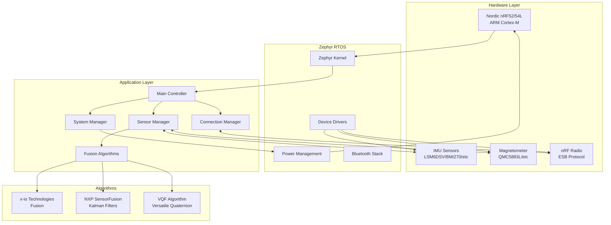
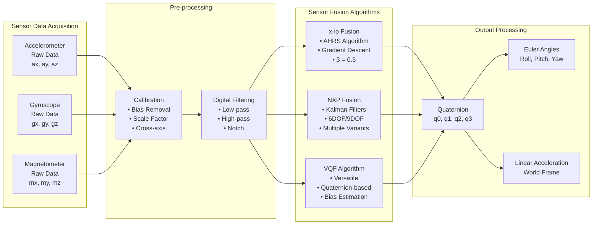
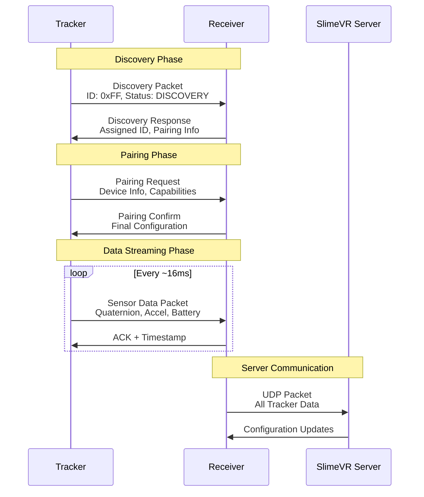
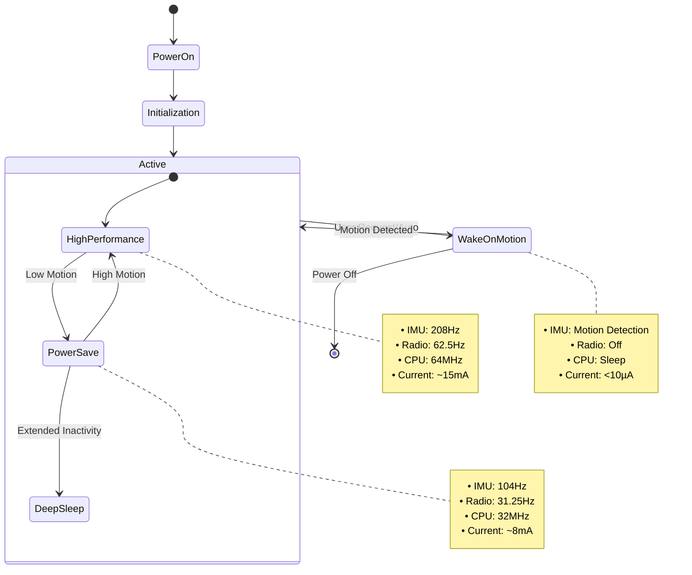

# SlimeVR Tracker nRF - Advanced Motion Tracking Firmware

> **Firmware avanzado para dispositivos de seguimiento de movimiento corporal completo basado en Nordic nRF52/nRF54L**

Este proyecto implementa un firmware completo para trackers de movimiento corporal que utiliza sensores IMU (Unidad de Medición Inercial) y algoritmos avanzados de fusión de sensores para proporcionar seguimiento de movimiento de alta precisión en tiempo real para sistemas SlimeVR.

## 🎯 Características Principales

- **Múltiples algoritmos de fusión de sensores**: x-io Technologies Fusion, NXP SensorFusion, VQF
- **Soporte para múltiples sensores IMU**: LSM6DSV, LSM6DSO, LSM6DSM, BMI270, y más
- **Comunicación inalámbrica robusta**: Enhanced ShockBurst (ESB) protocol
- **Gestión inteligente de energía**: Modos de bajo consumo y Wake-on-Motion
- **Calibración automática y manual**: Calibración de 6 lados y compensación de bias
- **Sistema operativo en tiempo real**: Basado en Zephyr RTOS

## 📋 Tabla de Contenidos

- [Arquitectura del Sistema](#-arquitectura-del-sistema)
- [Pipeline de Fusión de Sensores](#-pipeline-de-fusión-de-sensores)
- [Protocolo de Comunicación](#-protocolo-de-comunicación)
- [Gestión de Energía](#-gestión-de-energía)
- [Hardware Soportado](#-hardware-soportado)
- [Compilación](#-compilación)
- [Opciones de Configuración (Kconfig)](#️-opciones-de-configuración-kconfig)
- [Características Avanzadas](#-características-avanzadas)
- [Indicadores LED y Control del Usuario](#-indicadores-led-y-control-del-usuario)
- [Licencia](#-licencia)

## 🏗️ Arquitectura del Sistema

El firmware SlimeVR-Tracker-nRF implementa una arquitectura modular y robusta que separa claramente las responsabilidades entre los diferentes subsistemas:



### Componentes Principales

**1. Hardware Abstraction Layer (HAL)**
- Abstrae las diferencias entre diferentes sensores IMU
- Proporciona una interfaz uniforme para SPI/I2C
- Gestiona la configuración específica de cada sensor

**2. Sensor Manager**
- Coordina la lectura de múltiples sensores
- Implementa sincronización temporal precisa
- Gestiona FIFO buffers y procesamiento en lotes

**3. Fusion Engine**
- Ejecuta algoritmos de fusión de sensores en tiempo real
- Produce cuaterniones de orientación estables
- Implementa compensación de bias y calibración

**4. Connection Manager**
- Gestiona el protocolo de comunicación inalámbrica
- Implementa pairing automático y manual
- Optimiza el consumo de energía de la radio

## 🧮 Pipeline de Fusión de Sensores

El sistema de fusión de sensores es el corazón del tracker, combinando datos de acelerómetro, giroscopio y magnetómetro para producir orientaciones precisas:



### Algoritmos de Fusión Disponibles

**1. x-io Technologies Fusion**
```c
// Configuración típica del algoritmo x-io Fusion
FusionAhrsSettings settings = {
    .convention = FusionConventionNwu,  // North-West-Up
    .gain = 0.5f,                       // Ganancia del filtro
    .gyroscopeRange = 2000.0f,          // Rango del giroscopio
    .accelerationRejection = 90.0f,     // Rechazo de aceleración externa
    .magneticRejection = 90.0f,         // Rechazo de interferencia magnética
    .recoveryTriggerPeriod = 0          // Período de recuperación
};
```

**2. NXP SensorFusion Library**
- Implementa filtros de Kalman adaptativos
- Soporte para 1DOF, 3DOF, 6DOF y 9DOF
- Optimizado para microcontroladores ARM Cortex-M

**3. VQF (Versatile Quaternion-based Filter)**
- Algoritmo moderno y robusto
- Estimación automática de bias del giroscopio
- Menor dependencia del magnetómetro

## 📡 Protocolo de Comunicación

El sistema utiliza Enhanced ShockBurst (ESB) para comunicación inalámbrica de baja latencia y bajo consumo:



### Estructura de Paquetes

**Packet Types:**
- `PACKET_HANDSHAKE`: Establecimiento inicial de conexión
- `PACKET_ROTATION`: Datos de orientación (cuaternión)
- `PACKET_ACCEL`: Datos de aceleración lineal
- `PACKET_BATTERY`: Estado de batería y sistema
- `PACKET_SENSOR_INFO`: Información del sensor y calibración

**Optimizaciones:**
- Compresión de cuaterniones (eliminación de componente redundante)
- Batching de paquetes para reducir overhead
- Adaptive packet rate basado en movimiento

## ⚡ Gestión de Energía

El sistema implementa una gestión de energía sofisticada para maximizar la duración de la batería:



### Características de Gestión de Energía

**Modos de Operación:**
1. **High Performance**: Máxima precisión y frecuencia de muestreo
2. **Power Save**: Balance entre precisión y consumo
3. **Wake-on-Motion**: Consumo ultra bajo con activación por movimiento

**Optimizaciones:**
- Dynamic frequency scaling basado en actividad
- Intelligent sensor shutdown durante inactividad
- Batería monitoring con alertas tempranas

## 🔧 Hardware Soportado

### Microcontroladores
- **Nordic nRF52832**: ARM Cortex-M4, 64MHz, 512KB Flash
- **Nordic nRF52840**: ARM Cortex-M4, 64MHz, 1MB Flash, USB
- **Nordic nRF54L15**: ARM Cortex-M33, 128MHz, 1.5MB Flash

### Sensores IMU
| Sensor | Interface | Características |
|--------|-----------|----------------|
| LSM6DSV | SPI/I2C | 6DOF, hasta 7.68kHz, Machine Learning Core |
| LSM6DSO | SPI/I2C | 6DOF, hasta 6.66kHz, Finite State Machine |
| LSM6DSM | SPI/I2C | 6DOF, hasta 6.66kHz, Embedded Functions |
| BMI270 | SPI/I2C | 6DOF, hasta 6.4kHz, Intelligent Motion Features |

### Magnetómetros (Opcional)
- QMC5883L: Compensación de hard/soft iron
- HMC5883L: Legacy support
- LIS3MDL: Alta precisión
- MMC5983MA: Magnetómetro de alta precisión (18-bit), auto set/reset

### Placas de Desarrollo Soportadas
- SuperMini nRF52840 (I2C/SPI variants)
- XIAO BLE/BLE Sense
- SlimeNRF R3
- SlimeVR Mini P1
- Custom PCBs con configuración flexible

## 🔨 Compilación

Para instrucciones detalladas de compilación, consulta [COMPILE_INSTRUCTIONS.md](COMPILE_INSTRUCTIONS.md).

### Compilación Rápida

```bash
# Activar entorno virtual
source .venv/bin/activate

# Compilar para SuperMini I2C
west build \
  --board supermini_uf2/nrf52840/i2c \
  --pristine=always SlimeVR-Tracker-nRF \
  --build-dir SlimeVR-Tracker-nRF/build \
  -- \
  -DNCS_TOOLCHAIN_VERSION=NONE \
  -DBOARD_ROOT=SlimeVR-Tracker-nRF
```

### Configuración y Personalización

El firmware puede ser personalizado mediante archivos de configuración:

- **Kconfig**: Configuración de características y optimizaciones
- **Device Tree**: Configuración de hardware y pines
- **Board definitions**: Configuraciones específicas de placa

## ⚙️ Opciones de Configuración (Kconfig)

El firmware SlimeVR-Tracker-nRF ofrece múltiples opciones de configuración a través del sistema Kconfig. Estas opciones se pueden modificar antes de la compilación para personalizar el comportamiento del tracker.

### 🔋 Configuración de Batería

Selecciona el mapeo de voltaje de batería apropiado para tu sistema:

| Opción | Tipo | Por Defecto | Descripción |
|--------|------|-------------|-------------|
| `BATTERY_USE_REG_BUCK_MAPPING` | bool | - | Mapeo de potencia constante para sistemas con regulador buck (DCDC). Preferido para sistemas con regulador DCDC, medido a voltaje de sistema de 3.0V |
| `BATTERY_USE_REG_LDO_MAPPING` | bool | - | Mapeo de corriente constante para regulador LDO. Preferido para sistemas con regulador lineal |
| `BATTERY_NO_MAPPING` | bool | ✅ | Deshabilita mapeo de voltaje de batería. Siempre mapea al 100% - deshabilita monitoreo |

### 💡 Configuración de LED

Configura el mapeo de colores para los indicadores LED:

| Opción | Tipo | Por Defecto | Descripción |
|--------|------|-------------|-------------|
| `LED_RGB_COLOR` | bool | - | Usa mapeo de color RGB o RG si está disponible |
| `LED_TRI_COLOR` | bool | ✅ | Usa el mapeo de color por defecto para estados LED |

### 👤 Acciones del Usuario

Controla las acciones disponibles para el usuario:

| Opción | Tipo | Por Defecto | Descripción |
|--------|------|-------------|-------------|
| `USER_EXTRA_ACTIONS` | bool | ✅ | Permite usar múltiples pulsaciones para calibrar, emparejar o entrar en DFU. Por defecto, emparejamiento disponible manteniendo sw0 por 5 segundos |
| `IGNORE_RESET` | bool | ✅ | Si sw0 está disponible, no realizar acciones extra en reset |
| `USER_SHUTDOWN` | bool | ✅ | Permite al usuario usar reset o sw0 para apagar |

### ⚡ Gestión de Energía y Wake-up

Configura los modos de ahorro de energía y activación por movimiento:

| Opción | Tipo | Por Defecto | Dependencias | Descripción |
|--------|------|-------------|--------------|-------------|
| `USE_IMU_WAKE_UP` | bool | ✅ | - | Usa estado de activación por IMU si está presente |
| `DELAY_SLEEP_ON_STATUS` | bool | ✅ | `USE_IMU_WAKE_UP` | Retrasa el estado de wake-up si hay flags de estado activos o en modo emparejamiento |
| `WOM_USE_DCDC` | bool | - | `USE_IMU_WAKE_UP` | Usa DCDC en lugar de LDO en estado wake-up si es más eficiente |
| `CONNECTION_TIMEOUT_DELAY` | int | 300000 | `USER_SHUTDOWN` | Duración del timeout de conexión cuando no se detecta receptor (5 minutos) |

### 🔋 Ahorro de Energía de Sensores

Configura los timeouts y modos de bajo consumo:

| Opción | Tipo | Por Defecto | Dependencias | Descripción |
|--------|------|-------------|--------------|-------------|
| `SENSOR_LP_TIMEOUT` | int | 500 | - | Timeout de bajo consumo durante ausencia de movimiento (ms) |
| `SENSOR_USE_LOW_POWER_2` | bool | - | - | Usa modos de sensores de mayor latencia durante ausencia de movimiento |
| `USE_IMU_TIMEOUT` | bool | ✅ | `USE_IMU_WAKE_UP` | Usa estado de wake-up IMU durante ausencia de movimiento |
| `IMU_TIMEOUT_RAMP_MIN` | int | 1000 | `USE_IMU_TIMEOUT` \|\| `SENSOR_USE_LOW_POWER_2` | Timeout mínimo durante ausencia de movimiento (ms) |
| `IMU_TIMEOUT_RAMP_MAX` | int | 15000 | `USE_IMU_TIMEOUT` \|\| `SENSOR_USE_LOW_POWER_2` | Timeout máximo durante ausencia de movimiento - 15 segundos (ms) |
| `USE_ACTIVE_TIMEOUT` | bool | ✅ | `USE_IMU_WAKE_UP` \|\| `USER_SHUTDOWN` | Retrasa wake-up IMU o apagado durante actividad |
| `ACTIVE_TIMEOUT_THRESHOLD` | int | 15000 | `USE_ACTIVE_TIMEOUT` | Disparar timeout de actividad después de cierto umbral - 15 segundos (ms) |
| `ACTIVE_TIMEOUT_DELAY` | int | 900000 | `USE_ACTIVE_TIMEOUT` | Duración del timeout de actividad cuando se dispara - **15 minutos** (ms) |

### 📊 Configuración de Sensores

Configura las frecuencias de muestreo y escalas de los sensores:

| Opción | Tipo | Por Defecto | Dependencias | Descripción |
|--------|------|-------------|--------------|-------------|
| `SENSOR_ACCEL_ODR` | int | 200 | - | ODR solicitado del acelerómetro (Hz) - se ajustará al valor soportado más cercano |
| `SENSOR_GYRO_ODR` | int | 500 | - | ODR solicitado del giroscopio (Hz) - se ajustará al valor soportado más cercano. 400Hz recomendado para IMUs con densidad de ruido pobre (ej. BMI270, LSM6DS3TR-C) |
| `SENSOR_ACCEL_FS` | int | 4 | - | Escala completa del acelerómetro (g) - escala menor mejora ruido pero puede saturar |
| `SENSOR_GYRO_FS` | int | 1000 | - | Escala completa del giroscopio (dps) - escala menor mejora ruido pero puede saturar |
| `SENSOR_USE_MAG` | bool | ✅ | - | Usar magnetómetro si está presente |
| `USE_SENSOR_CLOCK` | bool | ✅ | - | Usar reloj externo del IMU si está presente |

### 🔄 Algoritmos de Fusión de Sensores

Selecciona el algoritmo de fusión de sensores:

| Opción | Tipo | Por Defecto | Descripción |
|--------|------|-------------|-------------|
| `SENSOR_USE_XIOFUSION` | bool | - | Usa x-io Technologies Fusion para fusión de sensores (basado en filtro Madgwick) |
| `SENSOR_USE_VQF` | bool | ✅ | Usa VQF para fusión de sensores (basado en filtro de Kalman) |

### 🎯 Calibración

Configura las opciones de calibración:

| Opción | Tipo | Por Defecto | Dependencias | Descripción |
|--------|------|-------------|--------------|-------------|
| `SENSOR_USE_6_SIDE_CALIBRATION` | bool | ✅ | `USE_SLIMENRF_CONSOLE` | Usa calibración de 6 lados para acelerómetro. La calibración se puede completar a través de la consola básica |

### 📡 Configuración de Radio

Configura la potencia de transmisión:

| Opción | Tipo | Por Defecto | Descripción |
|--------|------|-------------|-------------|
| `RADIO_TX_POWER` | int | 8 | Nivel de potencia de salida del radio (dBm). Un valor menor puede reducir el consumo de energía |

### 🛠️ Configuración de Consola

| Opción | Tipo | Por Defecto | Descripción |
|--------|------|-------------|-------------|
| `USE_SLIMENRF_CONSOLE` | bool | ✅ | Usar consola básica para comandos |

## 🔬 Características Avanzadas

### Sistema de Calibración
- **Calibración automática**: Detección automática de bias del giroscopio
- **Calibración de 6 lados**: Calibración completa del acelerómetro
- **Calibración magnética**: Compensación de hard/soft iron automática

### Diagnósticos del Sistema
- **Health monitoring**: Detección de fallos de sensores
- **Performance metrics**: Latencia, jitter, packet loss
- **Temperature monitoring**: Compensación térmica automática

### Interfaz de Desarrollo
- **Console UART/USB**: Comandos de debugging y configuración
- **RTT logging**: Logging en tiempo real sin overhead
- **OTA updates**: Actualizaciones over-the-air (en desarrollo)

## 🚥 Indicadores LED y Control del Usuario

### Patrones LED

El tracker utiliza diferentes patrones de LED para comunicar su estado actual. Los patrones están organizados por prioridad (0 es la más alta):

| Prioridad | Categoría | Patrón | Descripción |
|-----------|-----------|---------|-------------|
| 0 | **Boot/Power** | `ONESHOT_POWERON` | 3 parpadeos de 200ms - encendido del dispositivo |
| 0 | **Boot/Power** | `ONESHOT_POWEROFF` | 250ms apagado + desvanecimiento - apagado del dispositivo |
| 1 | **Sensor** | `ERROR_A` | 2 parpadeos de 500ms cada 5s - error de sensor |
| 1 | **Sensor** | `ERROR_B` | 3 parpadeos de 500ms cada 5s - error crítico de sensor |
| 1 | **Sensor** | `ERROR_C` | 4 parpadeos de 500ms cada 5s - fallo múltiple de sensores |
| 1 | **Sensor** | `ERROR_D` | Parpadeo continuo de 500ms - fallo total del sistema |
| 2 | **Conexión** | `SHORT` | 100ms encendido, 900ms apagado - modo emparejamiento |
| 2 | **Conexión** | `LONG` | 500ms encendido, 500ms apagado - esperando conexión |
| 2 | **Conexión** | `FLASH` | 200ms encendido, 200ms apagado - listo para conectar |
| 3 | **Estado** | `ONESHOT_PROGRESS` | 2 parpadeos de 200ms - operación en progreso |
| 3 | **Estado** | `ONESHOT_COMPLETE` | 4 parpadeos de 200ms - operación completada |
| 4 | **Sistema** | `ACTIVE_PERSIST` | 300ms encendido cada 10s - funcionamiento normal |
| 4 | **Sistema** | `ON_PERSIST` | 20% de intensidad continua - batería cargada |
| 4 | **Sistema** | `LONG_PERSIST` | 20% intensidad, 500ms on/off - batería baja |
| 4 | **Sistema** | `PULSE_PERSIST` | Pulsación cada 5s - cargando batería |

> **Interpretación en SuperMini**: Como el SuperMini tiene un solo LED, utiliza únicamente la **frecuencia y duración** de los parpadeos para comunicar información. Presta especial atención al número de parpadeos consecutivos y a los intervalos entre ellos para identificar correctamente el estado del tracker.

### Colores LED

Los colores disponibles dependen del hardware del tracker:

**SuperMini (1 LED PWM):**
- **🔵 LED Único**: El SuperMini cuenta con un solo LED PWM que maneja todos los estados
  - Todos los patrones (DEFAULT, SUCCESS, ERROR, CHARGING) se muestran con el mismo color
  - La información se transmite a través de la **frecuencia de parpadeo** y **duración**, no del color
  - El LED puede variar en intensidad (brillo) según el patrón

**Trackers Dual Color (2 LEDs PWM):**
- **🔵 Azul (DEFAULT)**: Estados normales de operación y boot  
- **🔴 Rojo (ERROR)**: Errores del sistema, fallos de sensores
- **🟣 Combinaciones**: Diferentes combinaciones de azul/rojo para SUCCESS y CHARGING

**Trackers Tri-Color/RGB (3+ LEDs PWM):**
- **🔵 Azul (DEFAULT)**: Estados normales de operación y boot
- **🟢 Verde (SUCCESS)**: Operaciones completadas exitosamente, batería cargada
- **🔴 Rojo (ERROR)**: Errores del sistema, fallos de sensores
- **🟠 Naranja (CHARGING)**: Estados relacionados con carga de batería

> **Detección Automática**: El firmware detecta automáticamente el número de LEDs disponibles en el hardware y ajusta el mapeo de colores. Para trackers con LEDs limitados, la información se comunica principalmente a través de patrones temporales.

### Control con Botón SW0

El botón SW0 permite diferentes acciones según el número de pulsaciones y duración:

#### Pulsaciones Rápidas (< 1 segundo)

| Pulsaciones | Acción | Descripción |
|-------------|--------|-------------|
| **1x** | Reinicio | Reinicia el dispositivo manteniendo configuración |
| **2x** | Calibración IMU* | Inicia calibración manual de sensores |
| **3x** | Reset de Emparejamiento | Borra la información de emparejamiento |
| **4x** | Modo DFU | Entra en modo bootloader para actualizaciones |

*_Disponible solo si `CONFIG_USER_EXTRA_ACTIONS=y`_

#### Pulsación Prolongada (> 5 segundos)

- **Reset de Emparejamiento**: Mantener presionado por más de 5 segundos borra toda la información de emparejamiento y reinicia el proceso de conexión.

#### Indicadores Visuales del Botón

- **LED encendido continuo**: Se activa mientras se presiona el botón
- **LED apagado**: Indica que se ha registrado la secuencia de pulsaciones
- Durante operaciones del botón, el LED tiene la máxima prioridad y anula otros patrones

### Notas de Funcionamiento

- Los patrones de mayor prioridad siempre anulan a los de menor prioridad
- El patrón `OFF_FORCE` (prioridad 0) apaga forzosamente el LED ignorando otros patrones
- Las pulsaciones del botón requieren un tiempo de debounce de 50ms para ser registradas
- El timeout entre pulsaciones es de 1 segundo para completar una secuencia

#### Detección Automática de Hardware LED

El firmware detecta automáticamente el número de LEDs PWM disponibles durante la compilación:

- **1 LED PWM**: Modo single-color (SuperMini) - usa solo intensidad y temporización
- **2 LEDs PWM**: Modo dual-color - combina diferentes LEDs para crear patrones 
- **3+ LEDs PWM**: Modo tri-color/RGB completo - acceso a toda la gama de colores

Esta detección se basa en las definiciones del Device Tree del hardware específico y permite que el mismo firmware funcione en diferentes plataformas hardware sin modificaciones.

## 📖 Documentación Adicional

Para información detallada sobre uso y configuración:
- **Documentación oficial**: https://docs.shinebright.dev/diy/smol-slime.html
- **Hardware PCB**: https://github.com/SlimeVR/SlimeVR-Tracker-nRF-PCB
- **Esquemas EasyEDA**: https://oshwlab.com/sctanf/slimenrf3

## 📄 Licencia

Este código está licenciado bajo una doble licencia, puedes elegir entre:

- **MIT License** ([LICENSE-MIT](LICENSE-MIT) o https://opensource.org/license/mit/)
- **Apache License, Version 2.0** ([LICENSE-APACHE](LICENSE-APACHE) o https://opensource.org/license/apache-2-0/)

¡Elige la licencia que prefieras!

Cualquier contribución enviada intencionalmente para ser incluida en este trabajo estará licenciada bajo ambas licencias sin términos o condiciones adicionales.
