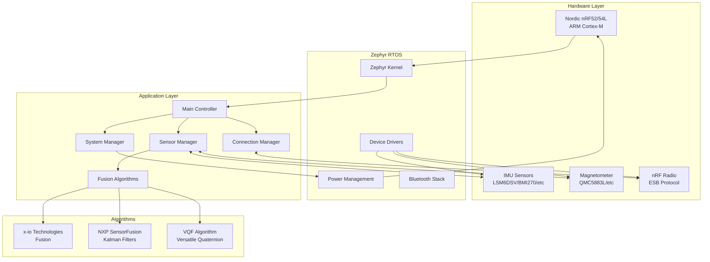
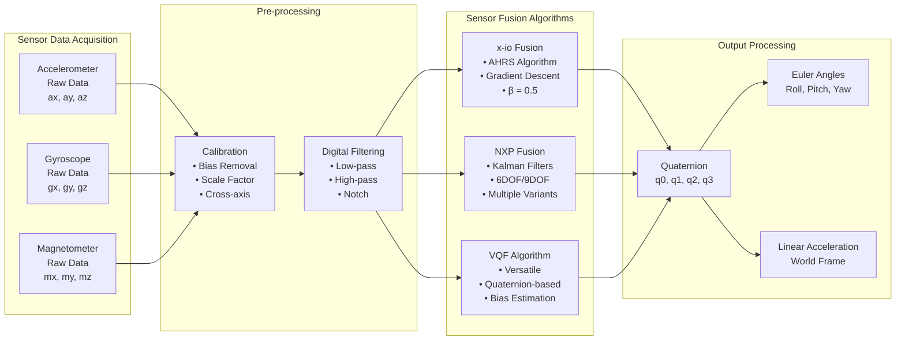
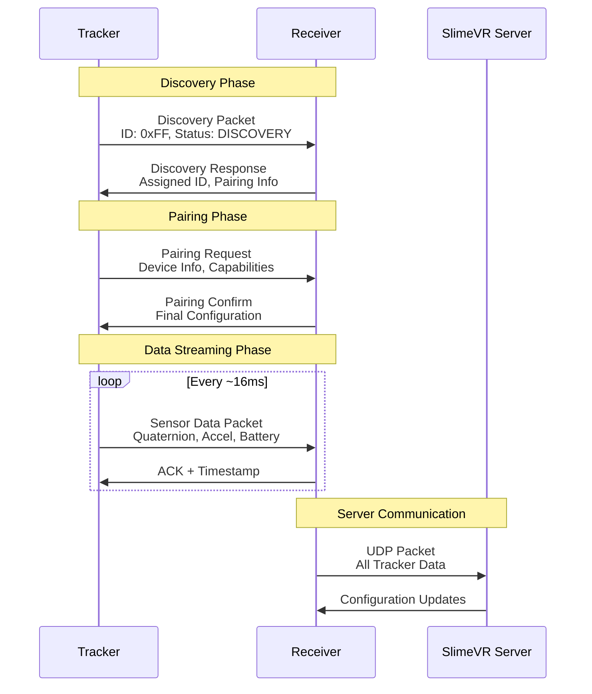
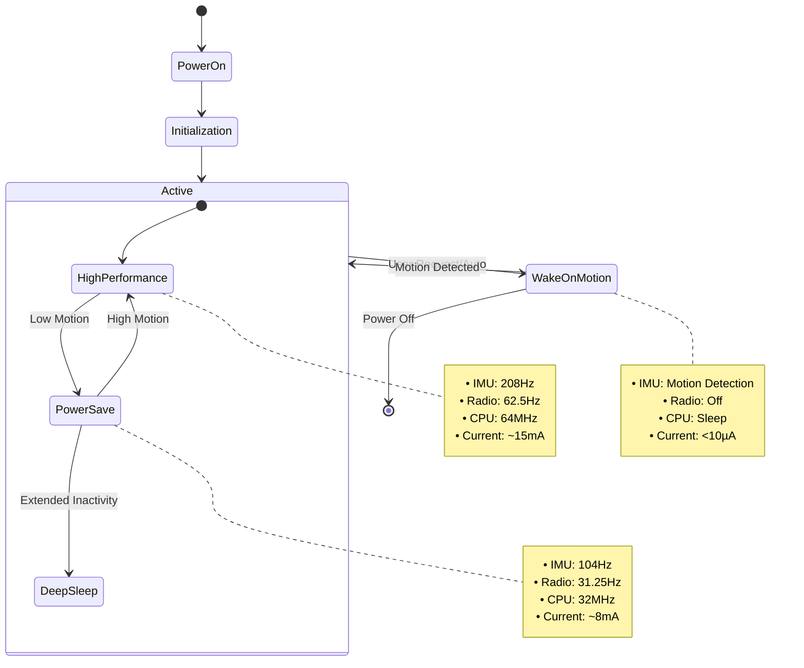

# SlimeVR Tracker nRF - Advanced Motion Tracking Firmware

> **Firmware avanzado para dispositivos de seguimiento de movimiento corporal completo basado en Nordic nRF52/nRF54L**

Este proyecto implementa un firmware completo para trackers de movimiento corporal que utiliza sensores IMU (Unidad de Medición Inercial) y algoritmos avanzados de fusión de sensores para proporcionar seguimiento de movimiento de alta precisión en tiempo real para sistemas SlimeVR.

## 🎯 Características Principales

- **Múltiples algoritmos de fusión de sensores**: x-io Technologies Fusion, NXP SensorFusion, VQF
- **Soporte para múltiples sensores IMU**: LSM6DSV, LSM6DSO, LSM6DSM, BMI270, y más
- **Comunicación inalámbrica robusta**: Enhanced ShockBurst (ESB) protocol
- **Gestión inteligente de energía**: Modos de bajo consumo y Wake-on-Motion
- **Calibración automática y manual**: Calibración de 6 lados y compensación de bias
- **Sistema operativo en tiempo real**: Basado en Zephyr RTOS

## 📋 Tabla de Contenidos

- [Arquitectura del Sistema](#-arquitectura-del-sistema)
- [Pipeline de Fusión de Sensores](#-pipeline-de-fusión-de-sensores)
- [Protocolo de Comunicación](#-protocolo-de-comunicación)
- [Gestión de Energía](#-gestión-de-energía)
- [Hardware Soportado](#-hardware-soportado)
- [Compilación](#-compilación)
- [Licencia](#-licencia)

## 🏗️ Arquitectura del Sistema

El firmware SlimeVR-Tracker-nRF implementa una arquitectura modular y robusta que separa claramente las responsabilidades entre los diferentes subsistemas:



### Componentes Principales

**1. Hardware Abstraction Layer (HAL)**
- Abstrae las diferencias entre diferentes sensores IMU
- Proporciona una interfaz uniforme para SPI/I2C
- Gestiona la configuración específica de cada sensor

**2. Sensor Manager**
- Coordina la lectura de múltiples sensores
- Implementa sincronización temporal precisa
- Gestiona FIFO buffers y procesamiento en lotes

**3. Fusion Engine**
- Ejecuta algoritmos de fusión de sensores en tiempo real
- Produce cuaterniones de orientación estables
- Implementa compensación de bias y calibración

**4. Connection Manager**
- Gestiona el protocolo de comunicación inalámbrica
- Implementa pairing automático y manual
- Optimiza el consumo de energía de la radio

## 🧮 Pipeline de Fusión de Sensores

El sistema de fusión de sensores es el corazón del tracker, combinando datos de acelerómetro, giroscopio y magnetómetro para producir orientaciones precisas:



### Algoritmos de Fusión Disponibles

**1. x-io Technologies Fusion**
```c
// Configuración típica del algoritmo x-io Fusion
FusionAhrsSettings settings = {
    .convention = FusionConventionNwu,  // North-West-Up
    .gain = 0.5f,                       // Ganancia del filtro
    .gyroscopeRange = 2000.0f,          // Rango del giroscopio
    .accelerationRejection = 90.0f,     // Rechazo de aceleración externa
    .magneticRejection = 90.0f,         // Rechazo de interferencia magnética
    .recoveryTriggerPeriod = 0          // Período de recuperación
};
```

**2. NXP SensorFusion Library**
- Implementa filtros de Kalman adaptativos
- Soporte para 1DOF, 3DOF, 6DOF y 9DOF
- Optimizado para microcontroladores ARM Cortex-M

**3. VQF (Versatile Quaternion-based Filter)**
- Algoritmo moderno y robusto
- Estimación automática de bias del giroscopio
- Menor dependencia del magnetómetro

## 📡 Protocolo de Comunicación

El sistema utiliza Enhanced ShockBurst (ESB) para comunicación inalámbrica de baja latencia y bajo consumo:



### Estructura de Paquetes

**Packet Types:**
- `PACKET_HANDSHAKE`: Establecimiento inicial de conexión
- `PACKET_ROTATION`: Datos de orientación (cuaternión)
- `PACKET_ACCEL`: Datos de aceleración lineal
- `PACKET_BATTERY`: Estado de batería y sistema
- `PACKET_SENSOR_INFO`: Información del sensor y calibración

**Optimizaciones:**
- Compresión de cuaterniones (eliminación de componente redundante)
- Batching de paquetes para reducir overhead
- Adaptive packet rate basado en movimiento

## ⚡ Gestión de Energía

El sistema implementa una gestión de energía sofisticada para maximizar la duración de la batería:



### Características de Gestión de Energía

**Modos de Operación:**
1. **High Performance**: Máxima precisión y frecuencia de muestreo
2. **Power Save**: Balance entre precisión y consumo
3. **Wake-on-Motion**: Consumo ultra bajo con activación por movimiento

**Optimizaciones:**
- Dynamic frequency scaling basado en actividad
- Intelligent sensor shutdown durante inactividad
- Batería monitoring con alertas tempranas

## 🔧 Hardware Soportado

### Microcontroladores
- **Nordic nRF52832**: ARM Cortex-M4, 64MHz, 512KB Flash
- **Nordic nRF52840**: ARM Cortex-M4, 64MHz, 1MB Flash, USB
- **Nordic nRF54L15**: ARM Cortex-M33, 128MHz, 1.5MB Flash

### Sensores IMU
| Sensor | Interface | Características |
|--------|-----------|----------------|
| LSM6DSV | SPI/I2C | 6DOF, hasta 7.68kHz, Machine Learning Core |
| LSM6DSO | SPI/I2C | 6DOF, hasta 6.66kHz, Finite State Machine |
| LSM6DSM | SPI/I2C | 6DOF, hasta 6.66kHz, Embedded Functions |
| BMI270 | SPI/I2C | 6DOF, hasta 6.4kHz, Intelligent Motion Features |

### Magnetómetros (Opcional)
- QMC5883L: Compensación de hard/soft iron
- HMC5883L: Legacy support
- LIS3MDL: Alta precisión
- MMC5983MA: Magnetómetro de alta precisión (18-bit), auto set/reset

### Placas de Desarrollo Soportadas
- SuperMini nRF52840 (I2C/SPI variants)
- XIAO BLE/BLE Sense
- SlimeNRF R3
- SlimeVR Mini P1
- Custom PCBs con configuración flexible

## 🔨 Compilación

Para instrucciones detalladas de compilación, consulta [COMPILE_INSTRUCTIONS.md](COMPILE_INSTRUCTIONS.md).

### Compilación Rápida

```bash
# Activar entorno virtual
source .venv/bin/activate

# Compilar para SuperMini I2C
west build \
  --board supermini_uf2/nrf52840/i2c \
  --pristine=always SlimeVR-Tracker-nRF \
  --build-dir SlimeVR-Tracker-nRF/build \
  -- \
  -DNCS_TOOLCHAIN_VERSION=NONE \
  -DBOARD_ROOT=SlimeVR-Tracker-nRF
```

### Configuración y Personalización

El firmware puede ser personalizado mediante archivos de configuración:

- **Kconfig**: Configuración de características y optimizaciones
- **Device Tree**: Configuración de hardware y pines
- **Board definitions**: Configuraciones específicas de placa

## 🔬 Características Avanzadas

### Sistema de Calibración
- **Calibración automática**: Detección automática de bias del giroscopio
- **Calibración de 6 lados**: Calibración completa del acelerómetro
- **Calibración magnética**: Compensación de hard/soft iron automática

### Diagnósticos del Sistema
- **Health monitoring**: Detección de fallos de sensores
- **Performance metrics**: Latencia, jitter, packet loss
- **Temperature monitoring**: Compensación térmica automática

### Interfaz de Desarrollo
- **Console UART/USB**: Comandos de debugging y configuración
- **RTT logging**: Logging en tiempo real sin overhead
- **OTA updates**: Actualizaciones over-the-air (en desarrollo)

## 📖 Documentación Adicional

Para información detallada sobre uso y configuración:
- **Documentación oficial**: https://docs.shinebright.dev/diy/smol-slime.html
- **Hardware PCB**: https://github.com/SlimeVR/SlimeVR-Tracker-nRF-PCB
- **Esquemas EasyEDA**: https://oshwlab.com/sctanf/slimenrf3

## 📄 Licencia

Este código está licenciado bajo una doble licencia, puedes elegir entre:

- **MIT License** ([LICENSE-MIT](LICENSE-MIT) o https://opensource.org/license/mit/)
- **Apache License, Version 2.0** ([LICENSE-APACHE](LICENSE-APACHE) o https://opensource.org/license/apache-2-0/)

¡Elige la licencia que prefieras!

Cualquier contribución enviada intencionalmente para ser incluida en este trabajo estará licenciada bajo ambas licencias sin términos o condiciones adicionales.
